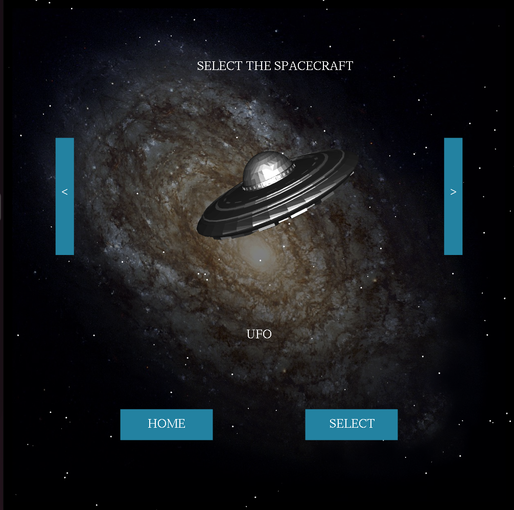

# OBJECT AVOIDING OBSTACLES

**Introduction:**

Our project is Object Avoiding Obstacles in 3-D. In this project we have basically made a spaceship (our object) that
is avoiding the multiple incoming asteroids (our obstacles) in space. The asteroids are coming from random
directions in space and the user will have to control the spaceship using the predefined keys to make it avoid the
asteroids. We have made this project as a game that the user can play. If the spaceship goes on without colliding with
the asteroids the score of the player will increase. If the spaceship collides with the asteroid then the game is over
and we display the final score. Our HOME window is shown below:

The game is made such that the asteroids are placed at a fixed position in space and the spaceship is moving in their
direction to avoid the collision. Our spaceship and asteroid are all made as models in a software called ‘Blender’, this
software allows us to make different models and then use them in our OpenGL project. Then we have imported these
models from Blender in OpenGL as .obj file extensions. Basically the .obj of each model contains the coordinates
and colors of that model that we have to use in our project. Moreover the user can also select the spaceship of his
choice to play the game. There are two modes to play the game namely Day and Night mode which we are
implementing using the Lighting Effect. Yo u can also listen to some nice tunes while playing the game making it fun
to play.

**Libraries Required:**

**1) #include "\.\./Library/main\.h"** :- This library is used to load and render the \.obj files and \.mtl files into OpenGL. This library contains following libraries:

> &nbsp;&nbsp;&nbsp;&nbsp;**a) #include "../Library/loadpng.h"**

> &nbsp;&nbsp;&nbsp;&nbsp;**b) #include "../Library/process\_image.h"**

> &nbsp;&nbsp;&nbsp;&nbsp;**c) #include "../Library/gl\_texture.h"**

**2) #include "\.\./Library/soil/SOIL\.h"** :- This library is used to render images into OpenGL\.

**3) #include <bits/stdc++\.h>** :- This library contains basic C++ in-built functions for calculations, using string,vectors, etc.

**4) #include <cstdlib>** :- This library contains system calls and we are using it for the play() system call\.

**Steps to run the project:**

\- Install OpenGL by following the instructions using the below link:

> [https://www.cyberithub.com/how-to-install-opengl-library-on-ubuntu-20-04-lts-focal-fossa](https://www.cyberithub.com/how-to-install-opengl-library-on-ubuntu-20-04-lts-focal-fossa/)[/](https://www.cyberithub.com/how-to-install-opengl-library-on-ubuntu-20-04-lts-focal-fossa/)

\- Install below libraries from linux terminal for sound and image functionality:
> sudo apt-get install sox

> sudo apt-get install libsox-fmt-mp3
 
> sudo apt-get install libsoil-dev

\- When we unzip the file, open the ‘Space Game’ folder, inside that folder open the ‘Game’ folder. Open the
 linux terminal in that folder and execute the below two commands.

\- To **Compile** the program use below command in terminal:

> g++ main.cpp -lglut -lGLU -lGL -lSOIL

\- To **Run** the program use below command in terminal:

> ./a.out

**Instructions to play the game:**

To start the game run the above command. A HOME window will appear where we have 3 options:

 1. PLAY : to play the game

 2. INSTRUCTIONS : to go to instruction window

 3. QUIT : to quit the game

If we click on the ‘PLAY’ button then we go to our next window in which we have to select the spaceship with which we have to play the game. There are 3 options for spacecraft:

 1. X-WING

 2. U.F.O

 3. SKY BLADE

We can select among the 3 spaceships using 2 buttons:
 
 1. The ‘>’ button goes to the next spaceship.
 
 2. The ‘<’ button goes to the previous spaceship.

Between these two buttons we have our sample model of each spaceship. Then below this model we have 2 buttons:

 1. ‘SELECT’ - to select the current spaceship and start the game,

 2. ‘HOME’ - to go back to the home window.

When we press on the ‘SELECT’ button our game starts. There are basically 4 keys using which the user can control the spaceship’s movement in four directions in the space. These keys are:

 1. ‘UP arrow’ key: used to move the spaceship in the upward direction.

 2. ‘DOWN arrow’ key: used to move the spaceship in the downward direction.

 3. ‘LEFT arrow’ key: used to move the spaceship in the left direction.

 4. ‘RIGHT arrow’ key: used to move the spaceship in the right direction.

Moreover we can also rotate the spaceship in all 3 dimensions using the mouse scroller (or touchpad) to avoid the
asteroids.

We also have two modes in our game namely DAY and NIGHT mode. Default mode is the Day mode. We have to
press the ‘N’ key to Enable (or Disable) the night mode. Then in the night mode we can also increase the shininess
property of our materials. Pressing ‘+’ key increases the shininess and pressing ‘-’ key decreases the shininess of the
materials.

When we are playing the game we can pause the game using the ‘SPACEBAR’ key. To PLAY the game again after
PAUSE we press ‘SPACEBAR’ again. When we press that ‘SPACEBAR’ key to PAUSE a window appears with a
HOME button in the top left corner to go to the HOME window.

We can play the game using these above instructions, but if we crash into some asteroid then the game is over and a
window appears that displays our ‘SCORE’ and the ‘DISTANCE COVERED’. Then again we have 3 options:
 1. ‘HOME’ - go to home window

 2. ‘PLAY AGAIN’ - to restart the game and go to the spacecraft selecting window

 3. ‘QUIT’ - quit the game

Following is the list of instructions to play the game:

**Sample Pictures:**

<table align="center">
  <tr align="center">
    <td><b>Day Mode</td>
    <td><b>Night Mode</td>
  </tr>
  <tr align="center">
    <td colspan="2">Home Page</td>
  </tr>
 <tr align="center">
  <td></td>
  <td></td>
 </tr>
 <tr align="center">
    <td colspan="2">First Spacecraft</td>
  </tr>
 <tr align="center">
  <td></td>
  <td></td>
 </tr>
 <tr align="center">
    <td colspan="2">Second Spacecraft</td>
  </tr>
 <tr align="center">
  <td></td>
  <td></td>
 </tr>
 <tr align="center">
    <td colspan="2">Third Spacecraft</td>
  </tr>
 <tr align="center">
  <td></td>
  <td></td>
 </tr>
 <tr align="center">
    <td colspan="2">Game</td>
  </tr>
 <tr align="center">
  <td></td>
  <td></td>
 </tr>
</table>

<table align="center">
 <tr align="center">
  <td>Instructions</td>
  <td>Collision Menu</td>
 </tr>
 <tr align="center">
  <td></td>
  <td></td>
 </tr>
</table>
